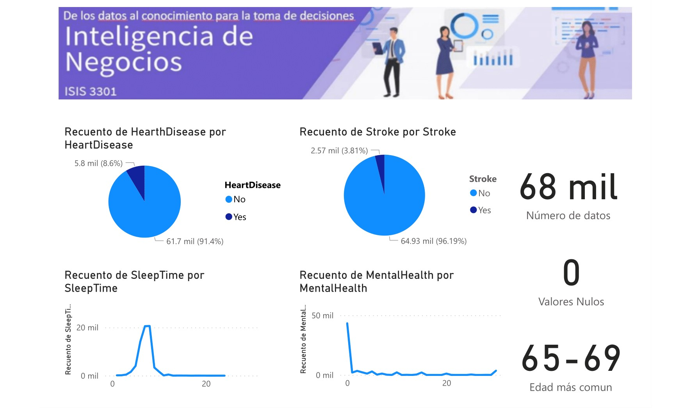

# Laboratorio 1 - Clasificación

## Objetivos

 - Comprender el proceso asociado a la preparación de datos para una tarea de clasificación. 
 - Utilizar una herramienta para el preprocesamiento, la limpieza, el perfilamiento de los datos y la construcción, evaluación, interpretación y uso del modelo.
 - Analizar e identificar los hiperparámetros adecuados para los modelos de clasificación propuestos.
 - Comparar 3 clasificadores utilizados y seleccionar uno que justifican y recomiendan a la organización.
 - Obtener conclusiones a nivel técnico y organizacional, a partir de los modelos generados.
 - Comunicar los hallazgos encontrados a la organización y explicar por qué tienen valor para el negocio.
 
## Herramientas
Durante este laboratorio trabajaremos con las siguientes herramientas:

 - Python
	 - Distribución sugerida: [Anaconda](https://www.continuum.io/downloads) 
		 - La versión de Anaconda es 4.4
		 - La versión usada es la de python 2.7, usar la de python 3 no debería requerir muchos cambios. 
	 - Ambiente de desarrollo
	   	 - JupyterLab
	   	 - Google Colab
	 - Librerías
	 	 - Pandas
		 - Scikit-learn
		 - Matplot
		 - Seaborn

## Enunciado 

Según la Organización Mundial de la Salud (OMS), las enfermedades cardiovasculares son la principal causa de muerte en todo el mundo. En Colombia, los datos más recientes del Departamento Administrativo Nacional de Estadística (DANE) revelan que de las 361.753 muertes registradas en 2021, 51.988 fueron causadas por enfermedades cardiovasculares.

SaludAlpes es una entidad de salud colombiana especializada en cardiología. Entre sus actividades principales se destaca el análisis de resultados de exámenes clínicos para la detección de enfermedades cardiovasculares. En particular, la detección de cardiopatía coronaria con el objetivo de prevenir ataques cardiacos en sus pacientes. Este servicio de diagnóstico implica un largo proceso por parte de los especialistas en el cual además de recolectar información sobre el paciente y sus factores de riesgo, deben realizar un análisis sobre los resultados de sus exámenes de clínicos. Este proceso en los últimos años ha generado una serie de problemas asociados con los tiempos de atención a estos pacientes, causados por demoras en la confirmación del diagnóstico. 

SaludAlpes los ha contratado para agilizar y mejorar el proceso de análisis de resultados clínicos de tal manera que se reduzcan los tiempos de confirmación de diagnóstico y se agilicen procesos de prevención y de tratamiento a los pacientes. Su labor como consultor de BI es agilizar el proceso de confirmación del diagnóstico de enfermedad cardiaca, en un paciente, utilizando datos proporcionados por SaludAlpes, que corresponden a una encuesta realizada sobre el estado de salud de 100.000 adultos mayores de 50 años. De igual manera, se espera que los resultados de la consultoría se comuniquen a la entidad para afianzar sus conocimientos en áreas de aprendizaje automático y al mismo tiempo generar una ventaja competitiva.

Con el fin de lograr el objetivo para el cual fue contratado, SaludAlpes espera tener tres modelos distintos de clasificación, construidos con 3 técnicas diferentes, entre las cuales deben estar árboles de decisión y KNN (k-nearest-neighbours). De igual manera, espera que siga la metodología que ellos utilizan en la actualidad para el desarrollo de ese tipo de proyectos, 
para lo cual le sugiere realizar los siguientes pasos:

1.	Descargar y entender los [datos](data/heart_disease_data.csv). Para esto puede utilizar el [diccionario](data/data_dictionary_hearth_disease.pdf) que contiene la descripción de los datos entregados.
2.	Realizar el entendimiento de los datos con un análisis exploratorio y perfilamiento de datos, al igual que con el análisis del nivel de calidad de los datos y las tareas de transformación que se requieren para construir modelos de clasificación utilizando técnicas como KNN y árboles de decisión entre otras. 
Adicionalmente, la entidad desea incluir como entregable, tableros de control para apoyar tareas de entendimiento de datos para lo cual sugiere mostrar estadisticas tales como cantidad de columnas, cantidad de datos, valores nulos, promedio de cada variable entre otros posibles datos que puedan proveer información útil a SaludAlpes. Utilice el tablero de control construido e incluya un video (max. 5 minutos), donde se presente el análisis de esta fase.
3.	Describir y justificar el preprocesamiento que debe realizar para preparar los datos y dejarlos listos para aplicar los algoritmos asociados con el uso de 3 técnicas de clasificación.
4.	Construir tres clasificadores diferentes con el uso de: K nearest-neighbours, árboles de decisión y uno de libre elección que permita clasificar los conjuntos de datos dados, de manera correcta. 
En este punto, deben justificar las decisiones más importantes asociadas con el proceso, tales como los criterios utilizados para la selección de hiperparámetros y las modificaciones a los datos para construir cada clasificador.
5.	Analizar los resultados obtenidos y justificar la utilidad de estos modelos para SaludAlpes.
6.  Comparar los distintos modelos obtenidos y explicar cuál recomendarían a SaludAlpes.
7.	Desarrollar una presentación donde expongan sus resultados y recomendaciones a SaludAlpes.

### Ejemplo de posible tablero de control

## Entregables 

 - Documento con todos los puntos que debe realizar en el laboratorio. 
 Incluya adicionalmente, el nombre del estudiante que realizó cada uno de los clasificadores. Por ejemplo, Felipe Gonzalez realizó el modelo basado en KNN. De igual manera, cada estudiante, debe incluir una descripción general de la forma como funciona el clasificador utilizado.
 - Presentación con los resultados obtenidos (punto 7).
 - Notebook que contiene el proceso realizado. El notebook debe estar ejecutado y debe incluir la persistencia del modelo.
 - Archivo csv con las predicciones de su mejor modelo respecto al conjunto de datos de [prueba](data/heart_disease_test.csv). De este conjunto de datos no se les proporcionará la variable objetivo, por ello solo deben entregar las prediciones. Los resultados obtenidos se ordenarán de acuerdo con la métrica de f1-score para su comparación.
 - Archivo que contiene el tablero de control creado (en modo de edición y si hay modificación de datos, los datos utilizados para el tablero) y un video corto de uso del tablero.

## Instrucciones de Entrega

Recuerde hacer la entrega por la sección unificada en Bloque Neón, antes del domingo 4 de septiembre a las 22:00.   
Este será el único medio por el cual se recibirán entregas. Entregas que no sean enviadas por ese medio o se reciban de forma tardía tendrán una nota de 0.0/5.0.

## Rúbrica de Calificación

A continuación se encuentra la rúbrica de calificación.

**Nota:** Los siguientes porcentajes hacen referencia a la nota grupal, que corresponde a un 80% de la nota individual.  
El 20% restante se calcula según el puntaje obtenido en la implementación del algoritmo del cual el estudiante estuvo a cargo dentro del grupo. Esta diferenciación lleva a que la nota obtenida en el laboratorio es individual y no grupal.

| Concepto | Porcentaje |
|:---:|:---:|
| Descripción y análisis del entendimiento de datos (incluye la identificacion de tareas sugeridas para la transformación de los datos)| 15% |
| Descripción del preprocesamiento realizado, según el algoritmo utilizado | 12% |
| Implementación de Arboles de decision, descripción de la forma como trabaja el algoritmo seleccionado y de las decisiones más importantes asociadas con la implementación del algoritmo y los hiperparametros configurados. Debe incluir el nombre del estudiante responsable de este entregable | 7% |
| Implementación de K-NN, descripción de la forma como trabaja el algoritmo seleccionado y de las decisiones más importantes asociadas con la implementación del algoritmo y los hiperparametros configurados. Debe incluir el nombre del estudiante responsable de este entregable | 7% |
| Implementación de un tercer algoritmo de libre elección, descripción de la forma como trabaja el algoritmo seleccionado y de las decisiones más importantes asociadas con la implementación del algoritmo y la selección de hiperparametros. Debe incluir el nombre del estudiante responsable de este entregable | 12% |
| Tablero de control utilizado para el entendimiento de datos (perfilamiento y análisis de calidad)| 10% |
| Análisis de los resultados obtenidos y justificación del modelo recomendado para el caso propuesto | 16% |
| Resultado de la ejecución del modelo con el conjunto de datos anexo, que no contiene etiqueta, utilizando el csv entregado  | 8% |
| Presentación para SaludAlpes con resultados y recomendaciones dadas a la empresa y video corto de uso del tablero para la fase de entendimiento de datos| 8% |
| Notebook asociado, ejecutado y con el modelo almacenado| 5% |
  

## Documentación de scikit-learn de apoyo
- [scikit-learn](https://scikit-learn.org/stable/supervised_learning.html#supervised-learning)

## Sugerencias

 - Nota 1: Como lo habrá notado, en los datos entregados hay atributos categóricos. Para poder realizar el proceso de clasificación hay que tratar estos valores.
 - Nota 2: Analizar si los valores de cada columna corresponden a valores adecuados para el negocio, en caso de que no lo sean, deben tratar dichos valores y justificar sus decisiones.
 - Nota 3: Utilizar los datos que sean útiles para determinar un posible diagnóstico de enfermedad del corazón.
 - Nota 4: Para el preprocesamiento de los datos y los tableros de control se puede hacer uso de las herramientas del curso o de otras herramientas diferentes según el criterio propio.
 

## ACLARACIONES
 - Cada integrante del grupo debe estar encargado de la implementación de un clasificador distinto. Sin embargo, todos los integrantes del grupo deben tener la capacidad de explicar lo realizado por los demás compañeros y determinar la mejor solución para SaludAlpes. 
 - El análisis de resultados y su justificación debe ser realizado en grupo.
 - Las notas de los integrantes dentro de un mismo grupo de laboratorio pueden variar ya que cada integrante está encargado de la implementación de un clasificador distinto. 
 

## Referencias
- https://www.dane.gov.co/index.php/estadisticas-por-tema/salud/nacimientos-y-defunciones/defunciones-no-fetales/defunciones-no-fetales-2021